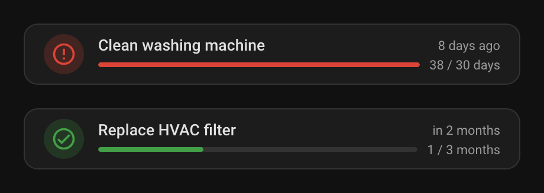
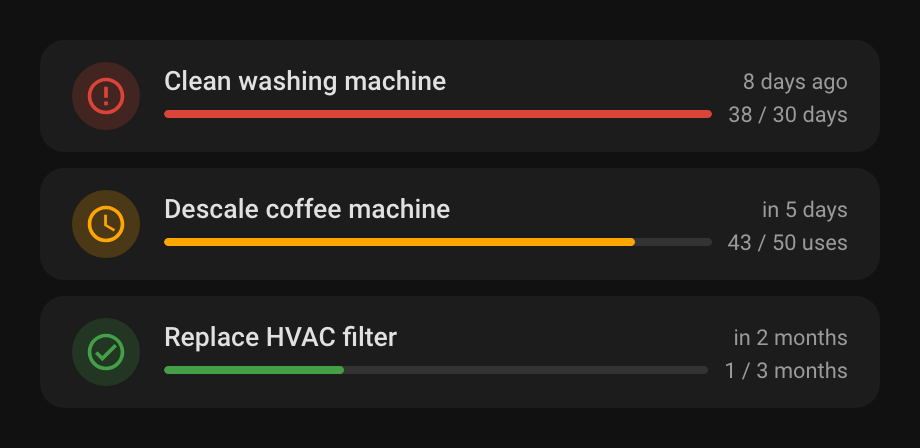

# Maintenance Tracker for Home Assistant

Custom integration that tracks recurring maintenance tasks and tells you when they're due.

Each **tracker** is one maintenance job (change oven filter, clean washer, replace HVAC filter). A tracker's state is one of `ok`, `due_soon`, `overdue`. Attributes expose the estimated due date, the current counter, progress toward the next due, and when it was last done.

## Criteria

| Criterion | When it becomes due |
|---|---|
| `time_elapsed` | The configured interval has passed since it was last done |
| `entity_on_duration` | A target entity has spent the configured duration in the "on" state since it was last done |
| `entity_usage_count` | A target entity has transitioned `from → to` state N times since it was last done |
| `recurring_date` | A specific calendar date — every Nth of the month, or every Nth of a specific month (e.g. every 1st of October) |
| `template_boolean` | A Jinja template renders a truthy value |
| `template_numeric` | A Jinja template renders a number that reaches the configured threshold |

Durations (interval / on-duration threshold) accept **minutes, hours, days, weeks, months, or years**. Months and years are computed as 30.4375 and 365.25 days respectively.

## Installation

**HACS (recommended):** add this repository as a custom integration in HACS, then install *Maintenance Tracker*.

**Manual:** copy `custom_components/maintenance` into your Home Assistant `config/custom_components/` directory.

Restart Home Assistant.

## Usage

1. **Settings → Devices & Services → Add integration → Maintenance**.
2. From the integration card, **Add tracker** and follow the flow to configure the criterion.
3. The new sensor `sensor.<tracker_name>` and companion `button.<tracker_name>_mark_done` become available.
4. To mark a task done, press the button, call the `maintenance.mark_done` service, or listen for the `maintenance_completed` event in automations.

## Sensor shape

```yaml
sensor.oven_cleaning:
  state: due_soon
  attributes:
    estimated_due_date: 2026-08-14T00:00:00+00:00
    counter: 435
    counter_unit: hours
    last_done_date: 2026-05-14T09:12:00+00:00
    progress: 87
    criterion: entity_on_duration
    threshold: 500
    warn_threshold_percent: 90
    silenced: false
```

## Template criteria

Template trackers react to any state in Home Assistant. Marking one done silences it: it stays `ok` until the condition is no longer active (boolean: the template renders false; numeric: the value drops below the warn threshold) **and** the optional cooldown has passed. While silenced, the `silenced` attribute is `true`.

The cooldown is meant for seasonal tasks that should fire once per season rather than on every change of the condition.

### Example: turn off the outside water before frost

Weather entities don't expose their forecast as an attribute, so a template can't read it directly. Add a trigger-based template sensor to `configuration.yaml` that fetches the forecast every hour and keeps the lowest temperature of the next 7 days:

```yaml
template:
  - triggers:
      - trigger: time_pattern
        hours: "/1"
      - trigger: homeassistant
        event: start
    actions:
      - action: weather.get_forecasts
        target:
          entity_id: weather.home
        data:
          type: daily
        response_variable: forecast
    sensor:
      - name: Frost forecast min temp
        unique_id: frost_forecast_min_temp
        unit_of_measurement: "°C"
        device_class: temperature
        state: >
          {{ forecast['weather.home'].forecast[:7]
             | map(attribute='templow') | reject('none') | min }}
```

Pick a weather entity whose daily forecast covers at least 7 days. Then add a `template_boolean` tracker with this template and a cooldown of about 150 days:

```jinja
{{ states('sensor.frost_forecast_min_temp') | float(99) < 0 }}
```

The tracker goes overdue once frost is forecast. After you mark it done, it stays quiet for the rest of the winter.

## Lovelace card

A custom card ships with the integration and auto-registers on startup — no manual resource setup required.



Add it via the visual editor: **Add card → Custom: Maintenance Tracker → pick a tracker sensor**. Or in YAML:

```yaml
type: custom:maintenance-card
entity: sensor.oven_filter
```

The card shows the tracker's name, a progress bar in the state color (green / orange / red for ok / due soon / overdue), the counter over the threshold, and the estimated due date as a relative time (e.g. "in 3 months", "3 days ago" when overdue). Clicking the tile opens the entity's more-info dialog.

### List card

A second card, `maintenance-list-card`, auto-discovers all trackers and lists them sorted by urgency (overdue first, then due soon, then ok — each group sorted by progress).


```yaml
type: custom:maintenance-list-card
hide_ok: false          # optional; hide healthy trackers
hide_due_soon: false    # optional; hide trackers that are due soon, leaving only overdue ones
hide_when_empty: false  # optional; hide the card entirely when there are no rows to show
separate_items: false   # optional; render each row as its own tile card (background + rounded corners) instead of stacked in one card
entities:               # optional; override auto-discovery
  - sensor.oven_filter
  - sensor.washer_clean
```

With `separate_items: true` every row becomes its own tile instead of sharing one card:



## Services

- `maintenance.mark_done` — mark target tracker(s) done. Optional `date` field (defaults to now).
- `maintenance.reset` — reset the counter without changing `last_done_date`.

## Events

`maintenance_completed` fires with `entity_id`, `tracker_id`, `date` whenever a tracker is marked done.
